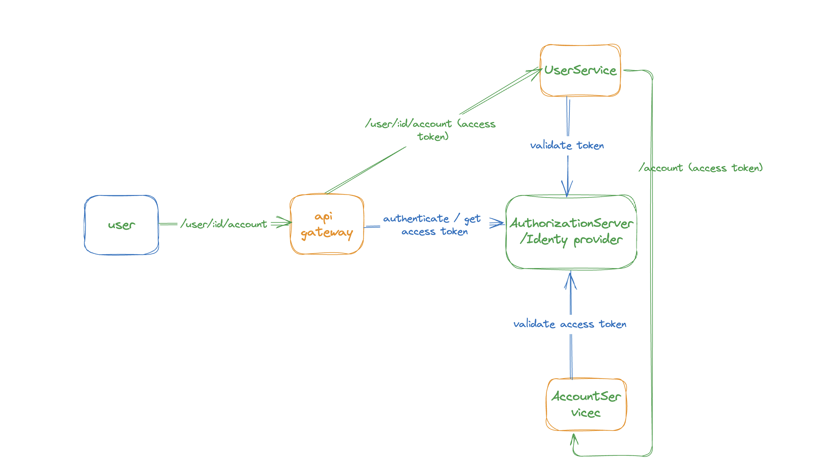
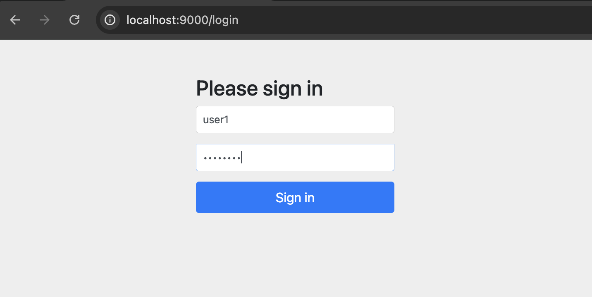
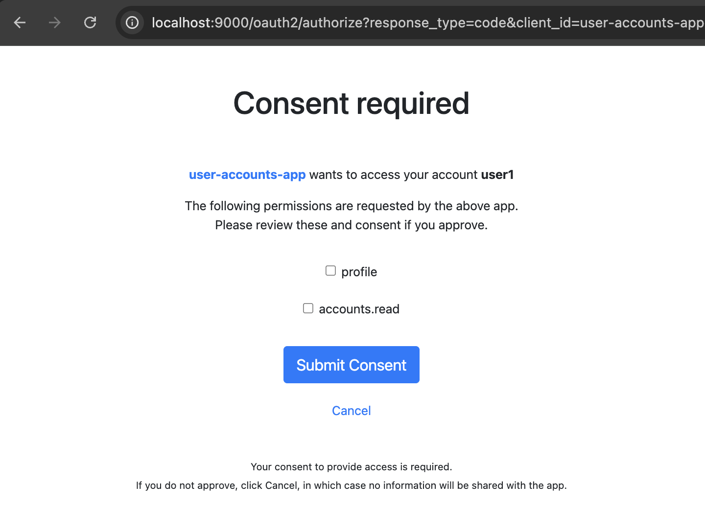
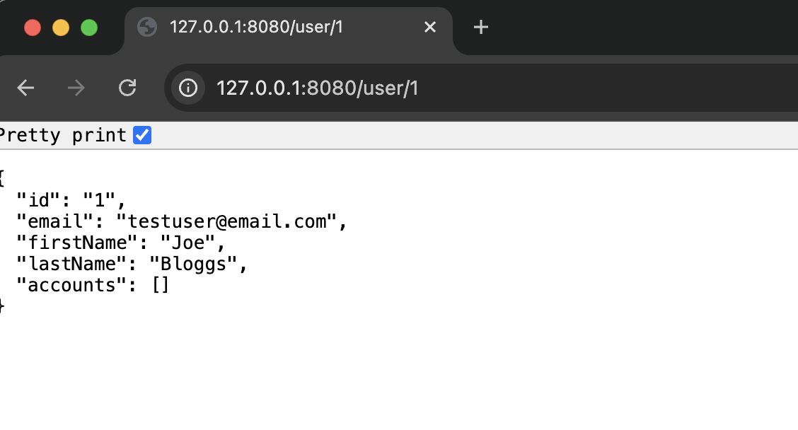
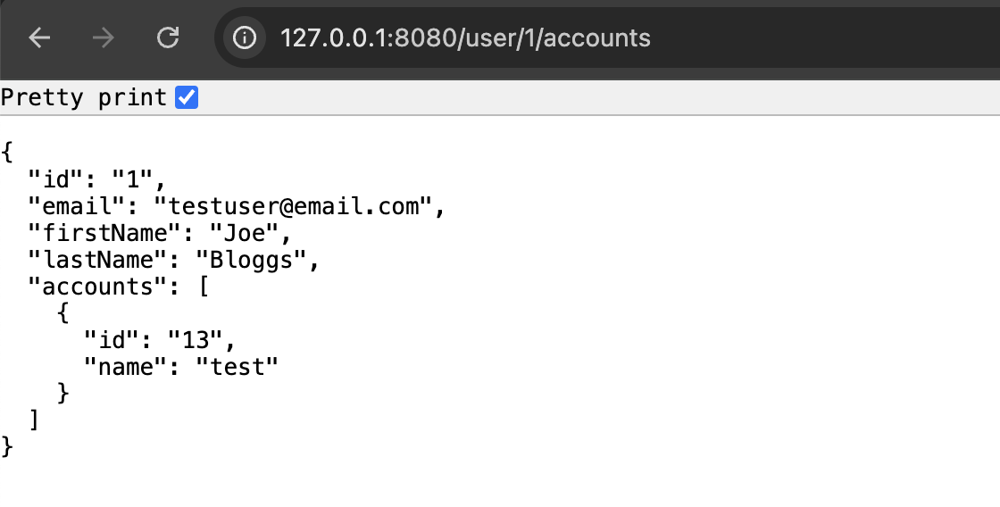

= Securing Microservices with Spring Security and OAuth2

A basic set up for microservices security using Spring Security OAuth2 support:

* spring cloud gateway as oauth client and resource server
* spring OAuth2 authorisation server as OAuth2 Authorisation server and Identity Provider
* microservices as oauth2 resource server




=== Running the demo:

* Start Authorization Server
```
cd authserver
./gradlew bootRun
```
* Start API Gateway
```
cd gateway
./gradlew bootRun
```
* Start User Service
```
cd userservice
./gradlew bootRun
```
* Start accountservice
```
cd accountservice
./gradlew bootRun
```

=== Testing

- Navigate to http://localhost:8080 to get prompted to login



- Give consent



- Navigate to retrieve user details



- Navigate to retrieve user details with accounts



